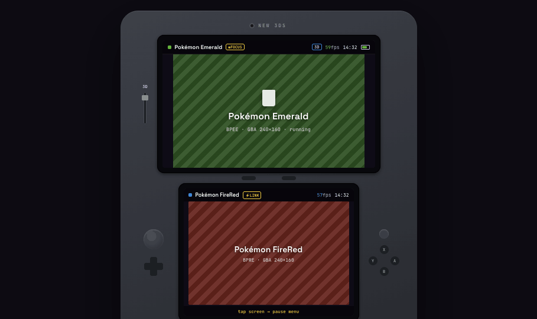
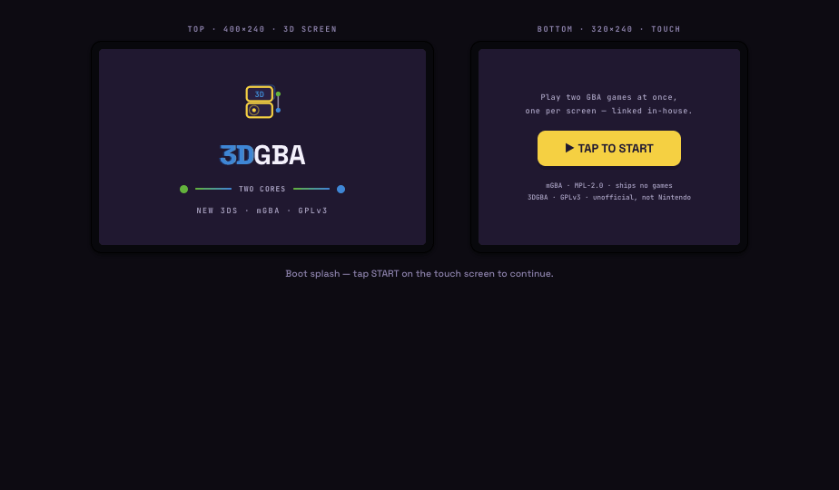
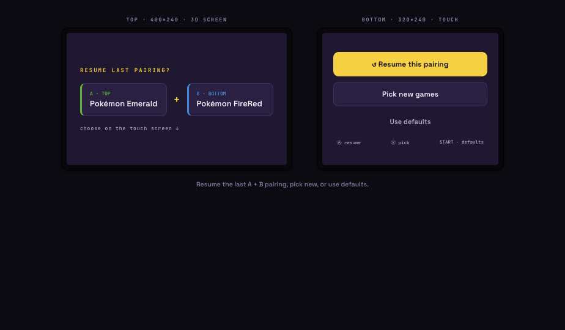
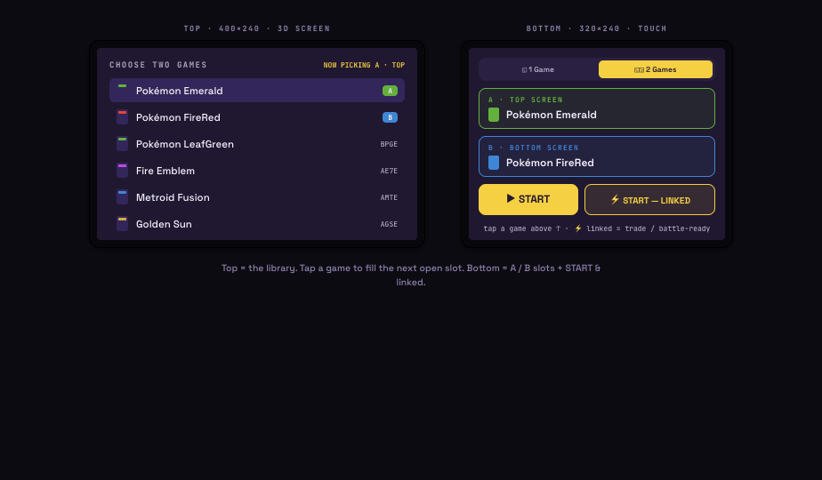
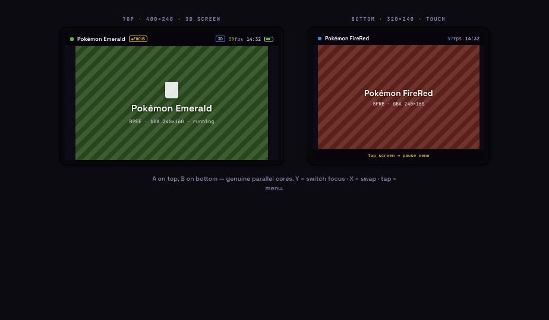
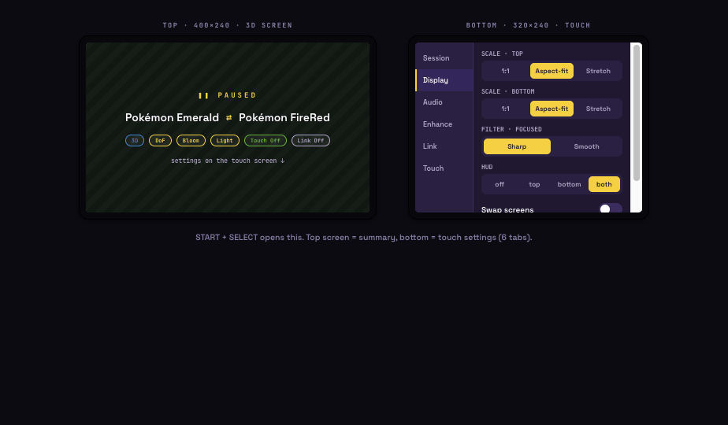
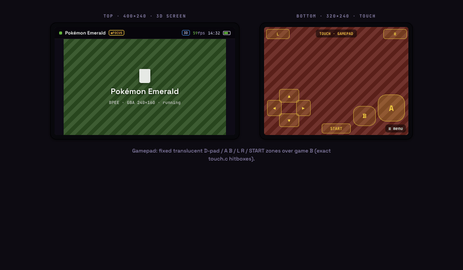
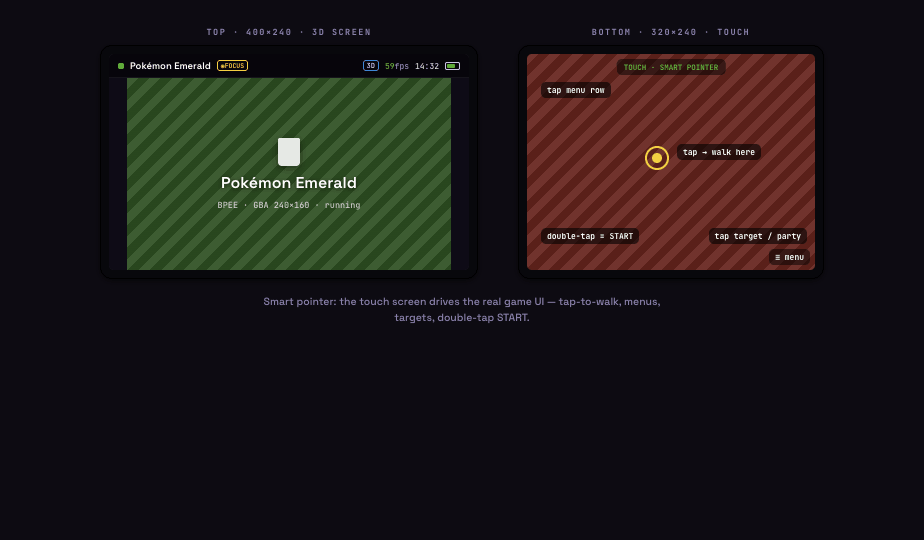
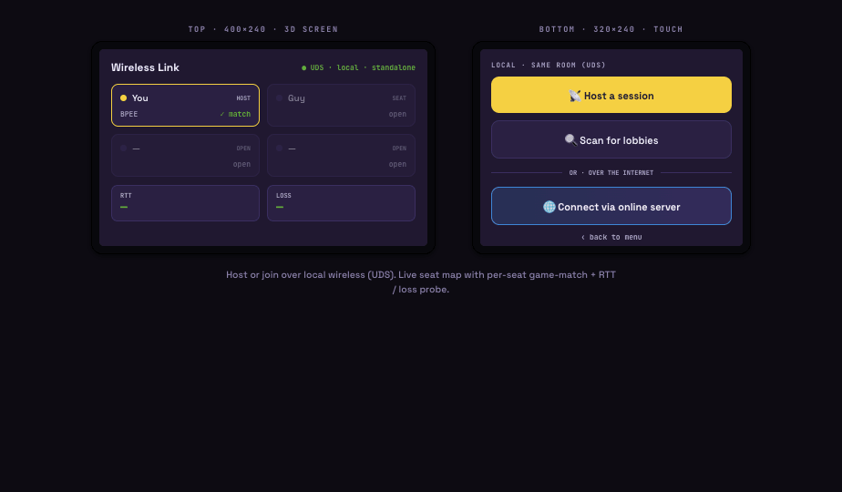
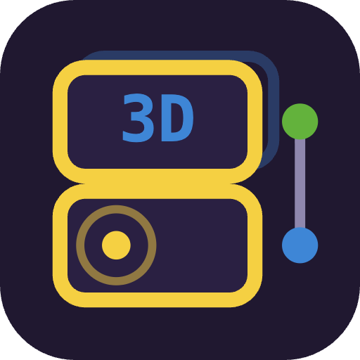

# Handoff: 3DGBA — dual-emulator UI redesign

> **Read this first.** The last implementation kept the old look and skipped the splash
> and app icon. This package fixes that: it contains a **pixel reference screenshot for every
> screen** (`screenshots/`), a **ready-made app icon** (`app_icon/`), and exact,
> line-level instructions tying each mockup to the C functions that draw it.
>
> **The bar is 1:1.** Match the reference screenshots — colors, hierarchy, spacing rhythm,
> copy, and the structure of every screen — as closely as citro2d allows. Re-fit only the
> *geometry* to the real panels (top **400×240**, bottom **320×240**); do **not** invent a new
> visual style, and do **not** leave any screen (splash + icon included) on the old design.

## What this is
3DGBA runs **two Game Boy Advance games at once on a New 3DS** — one real mGBA core per
screen, an emulated link cable, stereoscopic 3D on the top screen, and a touch controller on
the bottom. This is a **UI redesign** of the existing, working app. Emulation, threading, and
the HD-2D render passes already run on hardware — **do not touch them.** Only the on-screen UI
drawing, the theme system, the settings/persistence, the splash, and the app icon change.

## This is a C / 3DS app — recreate, don't port
The files in `prototypes/` are **design references authored in HTML**. They are **not** code to
port. 3DGBA is **C for the Nintendo 3DS** (devkitPro / libctru + **citro2d / citro3d**); it
draws its UI immediately to the two screens with `C2D_DrawRectSolid` / `C2D_DrawText` /
`C2D_DrawImageAt`. There is no DOM, no CSS, no HTML at runtime. **Recreate the mockups in the
existing C code, using its patterns:**

- UI is drawn per-frame in `run_session()` (in-game + pause menu), `run_splash()` (boot),
  `rompicker_run()` (game select), and `wireless_lobby_run()` — in/around `source/main.c`.
- Colors are `THEME_*` macros from **`theme.h`** (`THEME_BG`, `THEME_GOLD`, `THEME_PANEL`,
  `THEME_TEXT`, `THEME_LETTERBOX`, `THEME_MENU_DIM`, `THEME_SELTXT`, `THEME_HUD_BAR`,
  `THEME_BEZEL`, `THEME_GAME_A`, `THEME_GAME_B`). The redesign turns these into a **`Theme`
  struct** with 6 selectable palettes (below) + a custom builder.
- Prefs persist in the `Settings` struct + `settings_load`/`settings_save`
  (`sdmc:/3DGBA/settings.bin`), with a length-check that tolerates older files. New fields
  extend that struct the same way.
- citro2d text uses the single system font, scaled via `C2D_DrawText`'s scale args (HUD ≈ 0.4,
  hints ≈ 0.5). Preserve the **title vs. mono-label** hierarchy through size/weight, not font
  family (unless you ship a `.bcfnt`).

Coordinates in the mock are desktop-scaled — **never copy px values.** Lay out against
400×240 / 320×240; citro2d origin is top-left.

---

## Screenshot index (`screenshots/`)
Each is a "flat spec" capture: **left = top 400×240 screen, right = bottom 320×240 screen.**

**Canonical screens:** `01-boot-splash` · `02-resume-prompt` · `03-game-select` ·
`04-in-game-dual` · `05-pause-menu` · `06-touch-gamepad` · `07-touch-smart` ·
`08-wireless-lobby`
**Pause tabs:** `pause-tab-1-session` … `pause-tab-6-touch`
**Variants:** `game-select-single` · `in-game-single-controller` · `wireless-connected` ·
`wireless-online`
**Themes:** `theme-oled` · `theme-daylight` · `theme-duo` · `theme-retro` · `theme-custom`

---

## Design tokens

### Type
- **Space Grotesk** — titles, buttons, UI body. **JetBrains Mono** — labels, game codes
  (BPEE…), HUD stat line, badges. On device: one citro2d font; keep the hierarchy via
  size/weight/spacing.

### Fixed role colors (constant across every theme)
- **Game A / green `#63B23C`** — slot A, top-screen accent, "A" badge → `THEME_GAME_A`
- **Game B / blue `#3E86D6`** — slot B, bottom-screen accent, "B" badge → `THEME_GAME_B`
- **3D badge** — text `#A9D4FF` on a `#3E86D6` border
- **Link / focus / primary gold `#F5D042`** (Indigo theme accent)
- **Quit / error** — border/fill `#E4462E`, text `#E4796B`

### Theme palettes (6) — extend `theme.h`
Each theme = `bg, panel, panel2, line, acc, ink, text, dim, box`. Shipped default = **Indigo**.

| Theme | bg | panel | panel2 | line | acc | ink | text | dim | box |
|---|---|---|---|---|---|---|---|---|---|
| **Indigo + Gold** | `#201830` | `#2A2042` | `#33265A` | `#3B2E60` | `#F5D042` | `#20182F` | `#F4F1FB` | `#B0A8C8` | `#0E0B16` |
| **Midnight OLED** | `#0B0D12` | `#14171F` | `#1C2130` | `#242A3A` | `#F5D042` | `#0B0D12` | `#EAECF2` | `#8A90A2` | `#000000` |
| **Daylight** | `#EDEBE4` | `#FFFFFF` | `#F1EDE4` | `#DAD5CB` | `#BE7A16` | `#FFFFFF` | `#241C33` | `#6E6784` | `#DED9CE` |
| **Per-game Duo** | `#12161C` | `#1B222C` | `#232C38` | `#2E3846` | `#63B23C` | `#0A140A` | `#EAF0F2` | `#8FA0A6` | `#0A0D11` |
| **Retro Purple** | `#241246` | `#341C5E` | `#43277A` | `#4C3578` | `#E7B84A` | `#241246` | `#F3EDFF` | `#B29ED9` | `#160A2E` |

See `theme-oled.png`, `theme-daylight.png`, `theme-duo.png`, `theme-retro.png`.

**Custom (user builder)** — generated from 3 params (`theme-custom.png`):
- `bg  = hsl(baseHue, 24%, 9%)` · `acc = hsl(accentHue, 72%, 60%)`
- `panel/panel2/line`: lerp `bg`→white by `lift%`, `lift*1.9%`, `lift*2.7%` (lift range 6–24;
  clamp the two brighter mixes). `text` = bg→white 10%; `dim` = bg→white 46%; `box` = bg→black
  86%; `ink` = `#0B1014`.
- Preset (baseHue, accentHue): Teal 205,168 · Violet 262,275 · Amber 30,42 · Emerald 160,150 ·
  Coral 350,12.

### Shape (intent — re-fit to device)
Cards/buttons round in the mock; on citro2d draw as plain rects (radius optional). Focus cue =
**2px accent bar** under the focused screen's HUD (already in code). Unfocused game dims ~50%
toward black (already in code). Segmented pill: active = `acc` fill + `ink` text; inactive =
transparent + `dim`. Toggle: track `acc` on / `line` off, white knob.

---

## Screens

### 01 · Boot / splash → `run_splash()` ⚠ NOT YET DONE

**Current code** draws a placeholder: a green + blue `splash_panel` and the title **"DUAL GBA"**
with subtitle "two games - one link cable" (`source/main.c` ~L1691–1746, helper `splash_panel`
~L1671). **Replace that** with the layout above.

- **Top screen:** the **3DGBA logo** — two stacked cartridges (gold-outlined `THEME_PANEL`
  rounded rects), a small **"3D"** in blue `#3E86D6` in the upper cart, a gold dot + faint ring
  in the lower cart, and a green→blue link motif on the right. Under it the wordmark
  **"3DGBA"** (the "3D" in blue with a ±1.5px chromatic offset), then a
  **"● — TWO CORES — ●"** divider (green dot, green→blue gradient rule, blue dot), then
  `NEW 3DS · mGBA · GPLv3`. The logo art is the same glyph as `app_icon/` — you can redraw it
  with `C2D_DrawRectSolid` primitives or blit the icon texture.
- **Bottom screen:** pitch "Play two GBA games at once, one per screen — linked in-house.", a
  primary **`▶ TAP TO START`** button (gold fill, `ink` text), and two license lines:
  `mGBA · MPL-2.0 · ships no games` / `3DGBA · GPLv3 · unofficial, not Nintendo`.
- Keep the skippable timing (A/START/touch; the current `DUR`/ease-in animation is fine —
  animate the new elements in). Keep the perf-warning line for Old-3DS / not-at-full-speed.

### 02 · Resume prompt → NEW (add to the session loop in `main`, ~L1789)

Shown at boot when a recent pairing exists (`rompicker_save_recent` already records one at
~L1795). **Top:** heading `RESUME LAST PAIRING?`, two cards — **A · TOP** (green left border) +
gold `+` + **B · BOTTOM** (blue left border) with the last game names. **Bottom:** **↺ Resume
this pairing** (gold) / **Pick new games** (panel) / **Use defaults** (ghost) + hint row
`Ⓐ resume · Ⓧ pick · START · defaults`. Resume → session with the recent paths; Pick →
`rompicker_run`; Defaults → `gameA.gba`/`gameB.gba` (the existing fallback at ~L1792).

### 03 · Game select → `rompicker_run()` (expanded)

**Top (library):** title `CHOOSE TWO GAMES` (or `CHOOSE A GAME` single) + right status
`NOW PICKING A · TOP` / `B · BOTTOM`. Scrolling list; each row = per-game color chip + name +
an **A**/**B** badge if assigned, else its 4-char game code. **Bottom:** a **mode segmented
control `◱ 1 Game` / `◱◲ 2 Games`** (NEW), the **A slot** (green) + **B slot** (blue) cards,
then **`▶ START`** + **`⚡ START — LINKED`**. Tapping a library row fills the next open slot
(A then B). `⚡ linked` starts the session with the link already attached.

**Single-game mode** (`game-select-single.png`): one green slot ("TOP · 3D"), a "bottom = touch
controller" note, **`▶ START`** + **`🌐 LINK A FRIEND`**.

### 04 · In-game → `run_session()` render loop

**Dual:** top = game A, bottom = game B, each with a HUD bar (colored status dot, name,
`◉FOCUS` chip when focused, `3D` chip + `59fps` + clock + battery on top; `⚡LINK` chip on
bottom when linked), a gold focus bar under the focused HUD, and a bottom hint
`tap screen → pause menu`. This is mostly a **restyle** of the existing HUD draw
(top bar `C2D_DrawRectSolid(0,0,0,400,14,THEME_HUD_BAR)` + 2px focus bar + name at scale 0.4,
~L1552; bottom equivalent ~L1580) to the theme tokens + the chips shown.

**Single** (`in-game-single-controller.png`): top runs the one game in 3D; **bottom becomes the
touch controller** — header `◱ CONTROLLER` + game name + `● LINKED`/`SOLO` chip, an
**Off / Gamepad / Smart** segmented control, the controller body, footer `3D on top · ≡ menu`.

### 05 · Pause menu → REDESIGN of the `MENU_ITEMS` grid in `run_session()`

Today the menu is a **flat 2×10 button grid** over a dim overlay: `MENU_ITEMS[20]`, drawn at
`bx = 4 + (i&1)*160`, `by = 2 + (i>>1)*22`, 152×20 buttons (`source/main.c` ~L1607–1660; input
~L1251–1420). **Replace the grid with a left tab rail (~74px) + content panel**, keeping the
top screen as a **summary** (`❚❚ PAUSED`, the game name(s) with `⇄` between when dual, a row of
active-feature pills, `settings on the touch screen ↓`). Keep D-pad **and** tap parity.

**The 6 tabs are a re-grouping of the SAME `MENU_ITEMS` actions — no new emulator features.**
Index map (from the `#define MENU_*_IDX` block ~L975):

| Tab | Controls → existing action / `Settings` field |
|---|---|
| **Session** (`pause-tab-1-session.png`) | ▶ Resume (idx 0) · ⟳ Change games (idx 17 → returns `SESSION_CHANGE`) · ⏻ Quit (idx 18 → `SESSION_QUIT`) |
| **Display** (`pause-tab-2-display.png`) | Scale·Top `scaleMode[0]` + Scale·Bottom `scaleMode[1]` (`1:1`/`Aspect-fit`/`Stretch`, ZR cycles) · Filter·Focused `smooth[fs]` (Sharp/Smooth, ZL) · HUD idx 5 `hudMode` (off/top/bottom/both) · **toggles** Swap screens idx 6 `swapped`, Frameskip idx 4 `fsOn` |
| **Audio** (`pause-tab-3-audio.png`) | Mix mode idx 2 `audioMode` (Solo/Mixed/Split) · Volume A `volA` + Volume B `volB` steppers (store 0–256, show 0–100%) · Mute idx 10 |
| **Enhance** (`pause-tab-4-enhance.png`) | Header `✦ GEN-3 POKÉMON ENHANCEMENTS` · Tilt-shift DoF idx 12 `dofOn` · LDR Bloom idx 13 `bloomOn` · Time-of-day light idx 14 `lightOn` · Vivid idx 15 `vividOn` · **Stereoscopic 3D** = the hardware 3D-slider depth (show as an enable/status row; it gates DoF/bloom/light — there is no `MENU_ITEMS` entry for it) |
| **Link** (`pause-tab-5-link.png`) | Link cable idx 1 `linkOn` · Net link idx 19 `netOn` · 📡 Wireless lobby idx 16 → `wireless_lobby_run()` · Save state idx 7 · Load state idx 8 · Load .sav idx 9 |
| **Touch** (`pause-tab-6-touch.png`) | Touch mode idx 3 `touchMode` (Off/Gamepad/Smart) + explainer · Preview Gamepad/Smart · **Gamepad·Color** 5 swatches (NEW) · **Gamepad·Edges** Round/Soft/Sharp (NEW) |

### 06 · Touch · Gamepad → `touch.c` `TOUCH_PAD` + `touch_draw()`

Translucent controller over game B (or the single game): D-pad, large **A** + **B**, shoulder
**L**/**R**, **SELECT**/**START**, a `TOUCH · GAMEPAD` label, `≡ menu`. All glyphs tint to the
chosen **pad color**; corner radius follows the **edge** setting (Round ≈ 11px / Soft ≈ 5px /
Sharp ≈ 1px; buttons 50% / 32% / 22%). **Keep the existing `touch.c` hitbox zones exactly** —
this is a restyle, not a re-layout.

### 07 · Touch · Smart → `TOUCH_SMART`

The bottom screen is a **pointer on the real game UI** (draws almost nothing over the game). The
mock shows transient hint overlays (`tap → walk here`, `tap menu row`, `double-tap = START`,
`tap target / party`) + a `TOUCH · SMART POINTER` label — in-app these are transient/absent;
behavior (tap-to-walk, menu cursor, double-tap START) already lives in `touch_update`. Match the
label styling only.

### 08 · Wireless lobby → `wireless_lobby_run()`

**Top:** `Wireless Link` + status `● UDS · local` (or `NET · relay`) + state label; a **2×2 seat
map** (01 You/HOST gold, 02 Guy/SEAT blue when filled, 03/04 OPEN dimmed) with node id, name,
game code, and a match flag ✓ match / ✗ diff / open; two stat tiles **RTT** + **LOSS**.
**Bottom (idle):** `LOCAL · SAME ROOM (UDS)` — **📡 Host** / **🔍 Scan**; divider
`OR · OVER THE INTERNET`; **🌐 Connect via online server**. Per-state screens: Hosting (Cancel),
Scan (found-lobby card → join), Online (`relay.3dgba.net` + room `4KZ9` + Connect — see
`wireless-online.png`), Connected (`● Linked · 2 seats` + `⚡ Start linked trade` — see
`wireless-connected.png`). `‹ back to menu` returns to pause. Local vs online → `netMode`
UDS vs relay; connected exposes RTT/loss from the link probe.

---

## App icon → `app_icon/` ⚠ NOT YET DONE

The icon is **not** in `main.c`; it is baked into the 3DS build's SMDH from an `icon.png`. Two
ready files are provided:
- **`app_icon/icon-48.png`** — 48×48, the exact size devkitPro's default `Makefile` expects at
  `$(TOPDIR)/icon.png` (or the path in `APP_ICON`). **Drop this in as the project's `icon.png`.**
- **`app_icon/icon-512.png`** — master, for a CIA banner / store art / regenerating sizes.

Also set the SMDH metadata in the Makefile / build (title/description/author), e.g.
`APP_TITLE = 3DGBA`, `APP_DESCRIPTION = Two GBA games at once`, `APP_AUTHOR = Guy Shtainer`.
The icon design = the 3DGBA logo glyph on the `#201830` background (matches the splash logo).

---

## State — extend `Settings` (`source/main.c` ~L915) + `theme.h`
Currently persisted: `scaleMode[2]`, `smooth[2]`, `swapped`, `hudMode`, `audioMode`, `volA`,
`volB`, `touchMode`, `frameskip`, `dof`, `bloom`, `light`, `vivid`.
**Add:** `theme` (enum indigo/oled/daylight/duo/retro/custom), `customBaseHue`,
`customAccentHue`, `customContrast`, `gameMode` (single/dual), `padColor`, `padEdge`. Bump the
struct and extend the same tolerate-older-files length checks (`noVivid`/`noLight`/… pattern) so
existing `settings.bin` files still load. Every settings change already calls `settings_save(...)`
immediately — preserve that. Runtime-only state (focus, menu open, current tab, pick phase,
wireless state) stays as locals as it is now.

## Hardware controls — already implemented, keep
**Y** switch input focus · **X** swap screens (`swapped`) · **ZR** cycle focused scale · **ZL**
toggle focused filter · **START+SELECT** (or a tap when Touch = Off) open pause · **L/R** pass
through to the GBA · **3D slider** drives top-screen stereoscopic depth (overworld; gates
DoF/bloom/light).

## Files
- `screenshots/` — pixel reference for every screen, tab, variant, and theme (spec index above).
- `app_icon/icon-48.png`, `app_icon/icon-512.png` — the new app icon (48×48 + master).
- `prototypes/3DGBA Prototype.dc.html` — the clickable prototype (open it; the right-hand rail
  jumps between screens and switches theme). `prototypes/3DGBA - Design Directions.dc.html` —
  earlier exploration (context only). `prototypes/support.js` — runtime to open them in a
  browser.
- **Target codebase (your repo, not this bundle):** `source/main.c` + `theme.h`, `rompicker.*`,
  `gamestate.*`, `touch.*`, `audio.*`, `netlink.*`, `wireless.*`, `gbacore.*`. **Do not modify
  emulation, threading, link/net drivers, or the HD-2D passes** — only UI drawing + theme +
  settings + menu structure + splash + icon.

## Suggested order
1. **`theme.h`** → `Theme` struct + `g_theme[6]`; route `THEME_*` through the active theme; add
   the custom generator.
2. **`Settings`** → add theme/custom/gameMode/padColor/padEdge; load+save.
3. **Pause menu** → tab rail + 6 tabs over the existing `MENU_ITEMS` actions; top-screen summary.
4. **Splash** (01) + **app icon** — the two the last pass missed.
5. **Resume prompt** (02) + **Game select** 1-/2-game mode (03).
6. **Touch gamepad** color/edge tokens (hitboxes unchanged) (06).
7. **Wireless lobby** seat-map + local/online restyle (08).
